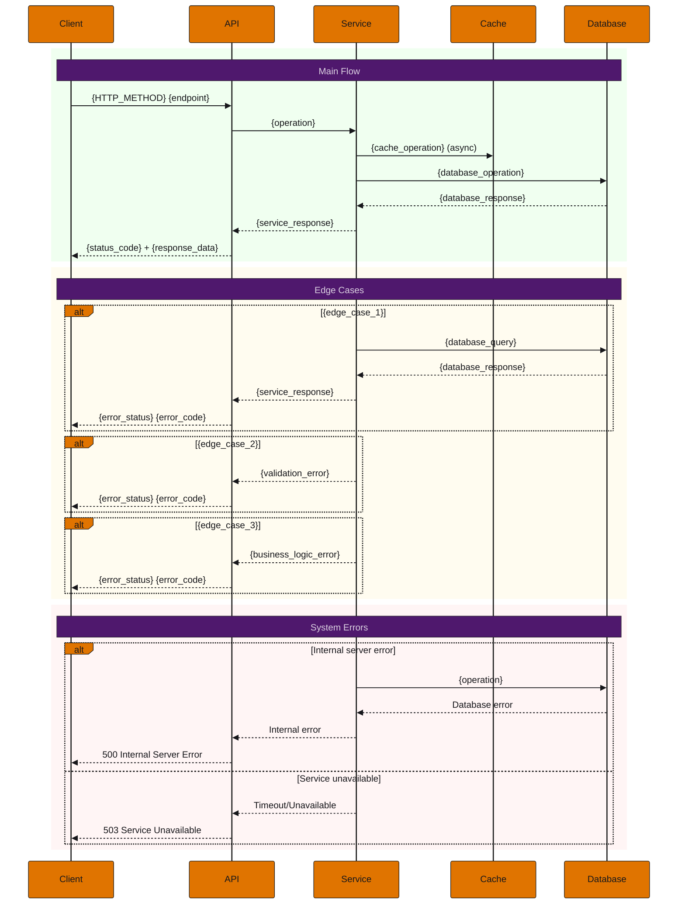

## Objective

**As** a {user_role},  
**I want** to {specific_objective},  
**So that** {benefit_and_value}.

---

## Acceptance Criteria

### Happy Path

```gherkin
Scenario: {success_scenario_name}
  Given {pre_condition}
  And {additional_pre_condition}
  When {action}
  Then {expected_result}
  And {additional_result}
  And {result_details}:
    | field  | value  |
    | field1 | value1 |
    | field2 | value2 |
```

### Corner Cases

```gherkin
Scenario: {edge_case_name}
  Given {pre_condition}
  When {action}
  Then {expected_result}
  And error code {error_code}
  And reason {error_reason}

Scenario: {another_edge_case_name}
  Given {pre_condition}
  When {action}
  Then {expected_result}
  And error code {error_code}
  And reason {error_reason}

Scenario: {third_edge_case_name}
  Given {pre_condition}
  When {action}
  Then {expected_result}
  And error code {error_code}
  And reason {error_reason}
```

### Error Cases

```gherkin
Scenario: Internal server error when {operation}
  Given the service is unstable
  When I try to {operation}
  Then the system should return error 500 Internal Server Error
  And error code ERR500_INTERNAL_ERROR
  And reason INTERNAL_SERVER_ERROR

Scenario: Service is under maintenance when {operation}
  Given the service is under maintenance
  When I try to {operation}
  Then the system should return error 503 Service Unavailable
  And error code ERR503_SERVICE_UNAVAILABLE
  And reason SERVICE_UNDER_MAINTENANCE

Scenario: Gateway timeout when {operation}
  Given the service is taking too long to respond
  When I try to {operation}
  Then the system should return error 504 Gateway Timeout
  And error code ERR504_GATEWAY_TIMEOUT
  And reason GATEWAY_TIMEOUT_EXCEEDED
```

---

## Domain Entities and Schemas

### Entity: {Entity_Name}

| Field  | Type  | Description  |
|--------|-------|--------------|
| field1 | type1 | description1 |
| field2 | type2 | description2 |
| field3 | type3 | description3 |

---

## API Specification

### Request

**HTTP Method:** `{GET|POST|PUT|PATCH|DELETE}`  
**Path:** `{/v1/resource/{identifier}}`  
**Scope:** `{entity}:{action}`

#### Headers

| Field                 | Type    | Required | Value                          | Description                                         |
|-----------------------|---------|----------|--------------------------------|-----------------------------------------------------|
| Accept                | string  | no       | application/vnd.guardia.v1+json| Expected contract type in response.                 |
| Content-Type          | string  | no       | application/vnd.guardia.v1+json| Contract type sent in the request.                  |
| Idempotency-Key       | string  | yes/no   | uuid                           | Idempotency key for the request.                    |
| X-Grd-Correlation-Id  | string  | no       | uuid                           | Correlation ID for distributed tracing.             |

#### Query Parameters

| Field  | Type  | Required | Default        | Description  |
|--------|-------|----------|----------------|--------------|
| field1 | type1 | yes/no   | default_value  | description1 |

#### Request Body (if applicable)

```json
{
  "field1": "value1",
  "field2": "value2"
}
```

### Response

#### Status Codes

**Success**
- 200 (OK)
- 201 (Created)
- 204 (No Content)

**Client Error**
- 400 (Bad Request)
- 404 (Not Found)
- 409 (Conflict)
- 422 (Unprocessable Entity)

**Server Error**
- 500 (Internal Server Error)
- 503 (Service Unavailable)
- 504 (Gateway Timeout)

#### Headers

| Field                 | Type    | Required | Value        | Description                                              |
|-----------------------|---------|----------|--------------|----------------------------------------------------------|
| Content-Type          | string  | yes      | application/json | Content type returned                                    |
| Content-Length        | string  | yes      | length        | Content size in bytes                                    |
| Idempotency-Key       | string  | yes/no   | uuid          | Idempotency key for the request.                         |
| X-Grd-Trace-Id        | string  | yes      | uuid          | Unique request identifier generated by the server         |
| X-Grd-Correlation-Id  | string  | yes/no   | uuid          | Unique identifier provided by the client (if sent)        |

#### Response Schema

**Success:**
```json
{
  "data": {
    "field1": "value1",
    "field2": "value2",
    "field3": "value3"
  }
}
```

**Error:**
```json
{
  "errors": [
    {
      "code": "{{code}}",
      "reason": "{{reason}}",
      "message": "{{message}}"
    }
  ],
  "reference": "https://docs.guardia.finance/api/known-errors/{entity_type}"
}
```

---

## Metrics

### Business Metrics

- Success rate for {operation}
- Total number of {operation} operations
- Error distribution by type (400, 404, 409, 500, 503)

### Performance Metrics

- Average request latency (p50, p90, p95, p99)
- Database response time
- Throughput rate (requests per second)
- Error rate (%)

### Infrastructure Metrics

- CPU usage
- Memory usage
- Number of concurrent database connections
- Cache hit/miss rate (if applicable)

### SLIs / SLOs

- Service availability: 99.99%
- Maximum latency (p99): 50ms
- Maximum error rate: 0.01%

---

## Sequence Diagram



---

## Use Cases

### {Use_Case_Title}

**Scenario:** {scenario_description}  
**Challenge:** {challenge_description}  
**Solution:** {solution_description}  
**Benefit:** {benefit_description}

---

## References

- [OpenAPI Specification](https://raw.githubusercontent.com/guardiafinance/hub/refs/heads/main/docs/api/{project}/{project}.openapi.yaml)
- [Guardia Documentation](https://docs.guardia.finance/)

---

## Additional Information

*(Optional)*

- **Priority:** High / Medium / Low
- **Complexity:** High / Medium / Low
- **Estimated Effort:** {story_points_or_hours}
- **Dependencies:** {list_dependencies}
- **Related Issues:** {list_related_issues}

---

## Template Usage Instructions

Para usar este template:

1. Substitua todos os placeholders `{variable}` pelos valores apropriados
2. Remova seções que não se aplicam ao seu caso específico
3. Adicione cenários específicos conforme necessário
4. Atualize o diagrama de sequência para refletir o fluxo real
5. Defina métricas específicas para sua funcionalidade
6. Inclua referências relevantes para sua implementação
